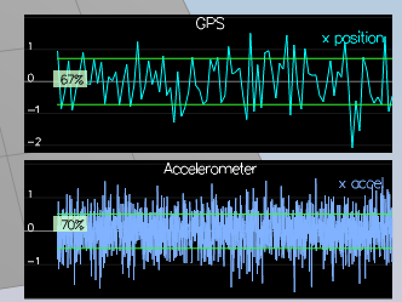
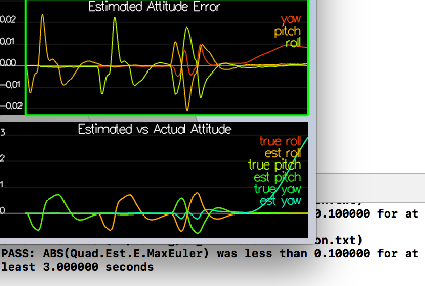
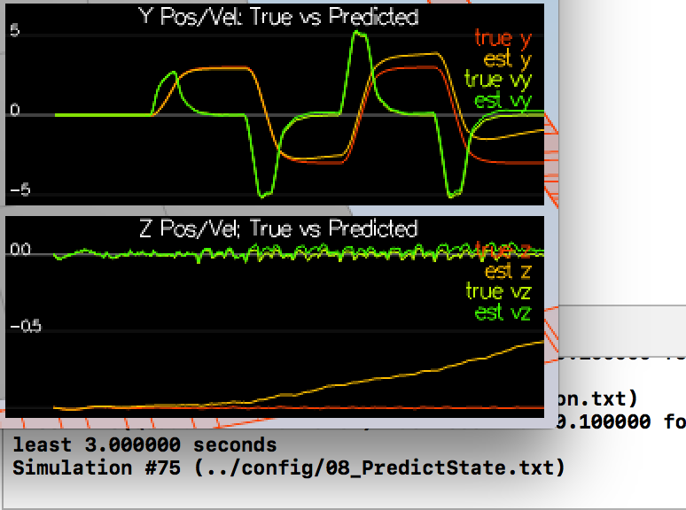
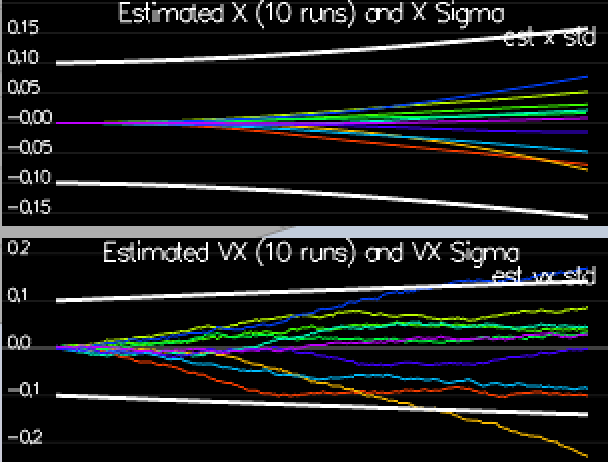
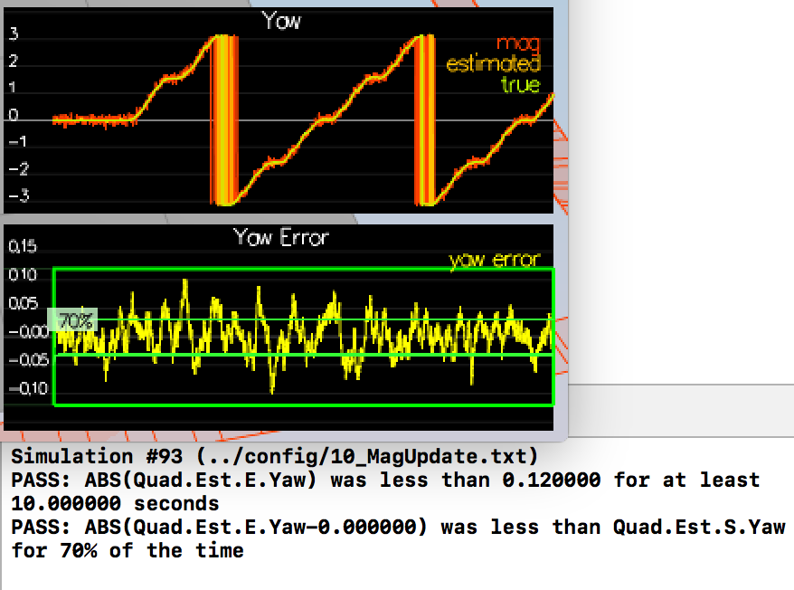
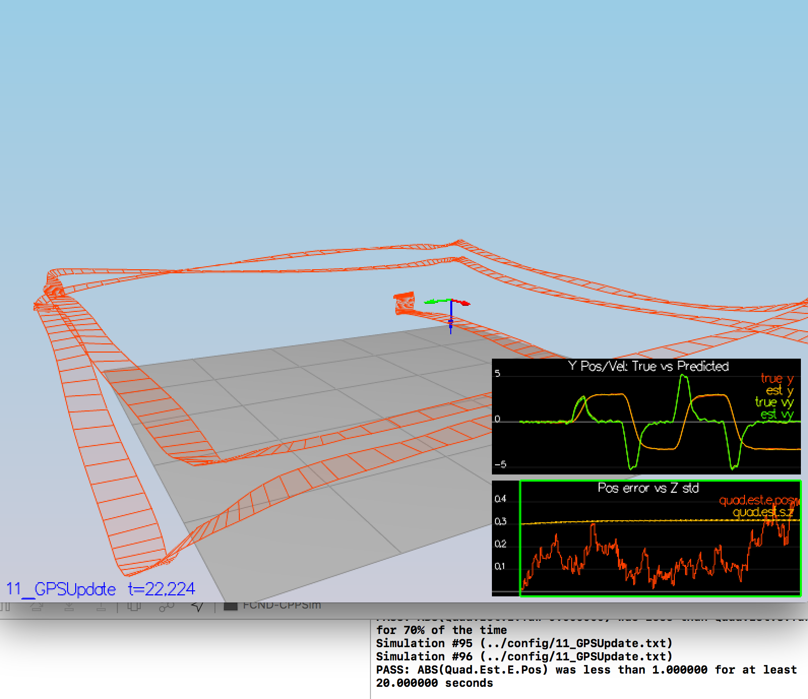

## Project: EKF Estimation

# Included in this project:
1. C++ EKF estimation code and tuned parameters

### Step 1: Sensor Noise

I ran the simulation and timed the capture of Graph1.txt and Grapht2.txt to get enough data. I then used Excel to calculate the standard deviation and plugged it back into 06_SensorNoise.txt and made sure the variation bands looked right as shown in image below.

### Step 2: Attitude Estimation

I implemented the non-linear complimentary math in UpdateFromIMU(). I used the quaternion approach and commented out the started code for the integration of the angles to avoid double-integration. Success criteria met as shown below.

### Step 3: Prediction Step

#### Scenario: 08_PredictState
I implemented PredictState() and made sure that the drift is minimal as seen in image below. I made sure I transformed the acceleration from the body frame to the inertial frame before advancing the state.

#### Scenario: 09_PredictionCov
I implemented the Predict() function which requires populated GetRbgPrime and using it to populate gPrime using the EFK math as shown in the lessons. The covariance graphs I got where like seen below.

### Step 4: Magnetometer Update
I implemented UpdateFromMag() function while taking care to make the yaw errors in the shortest absolute direction (clockwise / counter-clockwise). I made sure to update zFromX to be on the shorter update direction.
Passing criteria is shown in image below. hPrime population was trivial.

### Step 5: Closed Loop + GPS Update
I implemented UpdateFromGPS() function just like in previous step. hPrime implementation was trivial like before as its mostly a sparse matrix. Passing criteria reflected in graph below. 

### Concluding Remarks:

In this submission I am only including the estimation code, and tuned parameters for both controls and estimation. When I tried to use my previous implementation of QuadControls.cpp (which is subtely different that what came with this project) I was faced with a tuning task that wouldn't keep all scenarios happy. I could either have the controls part working or the estimation part working. This could be because there are bugs in my previous implementation that weren't caught before, and to make it work I'd have re-implement it and essentially make it not that different from the starter code in this project. Besides I think it takes the focus away from the estimation task. I believe there should be separation of concerns here. 